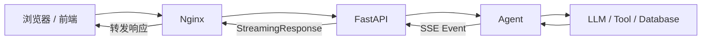
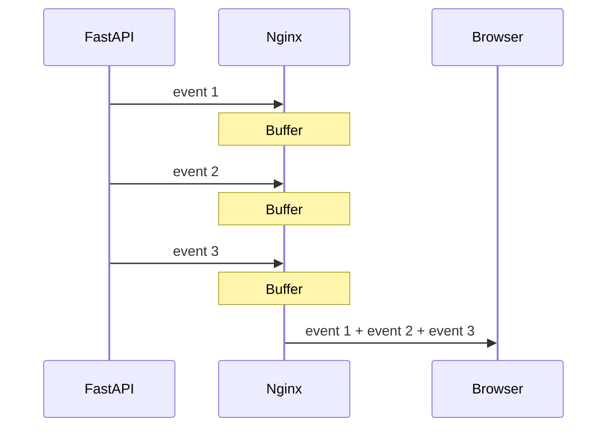
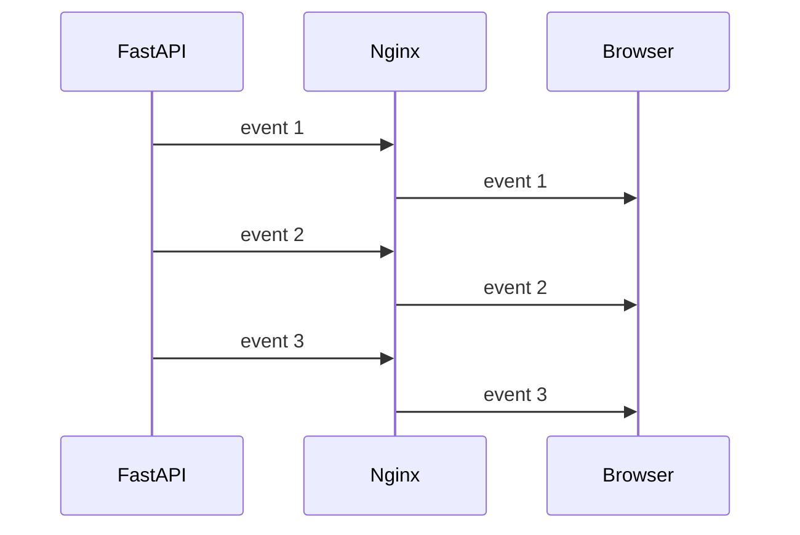
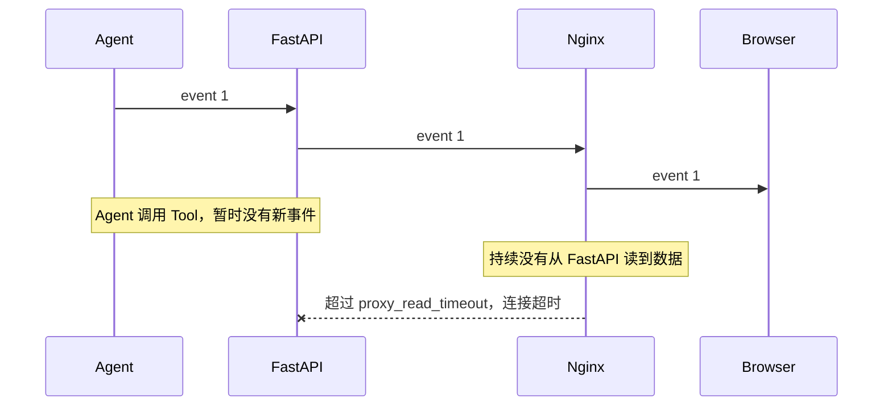

在 Agent 对话接口里，后端已经使用 FastAPI `StreamingResponse` 返回 SSE。服务端日志能看到 event 是分批产生的，但浏览器里的 EventStream 却经常几条事件挤在一起出现，页面表现就是：**先停顿一会，再突然刷出一大段内容**。

一开始很容易怀疑模型生成慢、FastAPI 没有真正流式输出，或者前端渲染有问题。实际排查后发现，问题出在 FastAPI 和浏览器之间的 **Nginx 反向代理缓冲**。

## 问题链路

请求并不是浏览器直接打到 FastAPI，中间还有 Nginx：



FastAPI 的流式输出本身没有问题。Agent 产生一个事件，FastAPI 就可以通过 `StreamingResponse` 往外发送一个事件。真正的问题是，响应从 FastAPI 出来以后还要经过 Nginx。

Nginx 作为反向代理，默认开启 `proxy_buffering on`。也就是说，它收到上游 FastAPI 的响应以后，会使用代理缓冲区处理这些数据，不保证 FastAPI 每输出一小段内容就马上原样转发给浏览器。

于是后端虽然是这样的：

```text
10:00:01  event 1
10:00:02  event 2
10:00:03  event 3
10:00:04  event 4
```

浏览器却可能看到：

```text
10:00:04  event 1
10:00:04  event 2
10:00:04  event 3
10:00:04  event 4
```

这就造成了“后端明明在流式输出，前端却像一次性返回”的现象。



这里并不是说 `proxy_buffering on` 一定会等整个响应彻底结束后才发送。更准确地说，Nginx 会对上游响应进行缓冲，可能出现“攒一批再发一批”的情况。在 SSE 场景里，这已经足够让前端失去实时输出的感觉。

## 关闭代理缓冲后为什么正常了

将 `proxy_buffering` 设置为 `off` 后，Nginx 不再主动缓冲这类代理响应。FastAPI 输出一小段 SSE 数据，Nginx 收到后会尽快继续转发给浏览器。



这时链路才真正表现出我们想要的效果：

**Agent 产生事件 → FastAPI 流式输出 → Nginx 立即转发 → 浏览器收到事件 → 前端实时渲染。**

所以排查 SSE 问题时，不能只看 FastAPI 有没有持续 `yield`。FastAPI 流式输出正常，只能证明后端这一层正常，并不能证明浏览器已经实时收到数据。

## `proxy_read_timeout` 为什么也要调大

解决缓冲后，还有另一个问题：Agent 并不是一直都有 SSE 数据产生。

例如 Agent 正在调用工具、查询数据库或者请求外部 API，这一步可能需要几十秒甚至更久。在这段时间里，FastAPI 没有新的事件发给 Nginx，但整个任务实际上还在正常执行。

假设 Nginx 的读取超时时间比较短：



`proxy_read_timeout` 控制的并不是“多久以后再把数据发给浏览器”，而是 **Nginx 最长允许连续多久没有从 FastAPI 读取到新数据**。

因此设置 `proxy_read_timeout 3600s`，表示 Agent 即使有一段时间没有产生新的 SSE 数据，Nginx 也可以继续保持这条代理连接，最长允许连续 3600 秒没有新数据，而不是过早判断上游超时。

所以这两个配置解决的是两个完全不同的问题：

| 配置 | 解决的问题 | 可以怎么理解 |
|---|---|---|
| `proxy_buffering off` | SSE 数据被 Nginx 攒起来，前端不能实时收到 | **有数据就尽快发，别攒** |
| `proxy_read_timeout 3600s` | Agent 长时间调用工具时没有新事件，连接容易超时 | **暂时没数据也继续等，别太早断** |

## 总结


后端 FastAPI 通过 `StreamingResponse` 做流式输出，SSE 事件会一条一条从后端产生。请求经过 Nginx 反向代理时，Nginx 默认开启 `proxy_buffering on`，会对后端响应进行缓冲，因此 SSE 数据可能被攒成一批再转发给浏览器，导致前端看起来不是实时输出。设置 `proxy_buffering off` 后，Nginx 不再主动缓冲这类代理响应，后端产生一段数据后，Nginx 会尽快向浏览器转发。

Agent 在调用工具、数据库或外部 API 时，可能一段时间没有新的 SSE 数据。如果 Nginx 连续超过 `proxy_read_timeout` 指定的时间都没有从 FastAPI 读取到新数据，就会认为上游连接超时并关闭连接。设置 `proxy_read_timeout 3600s`，就是允许这种“暂时没有新数据”的状态最长持续 3600 秒，避免 Agent 长时间执行过程中 SSE 连接被过早断开。